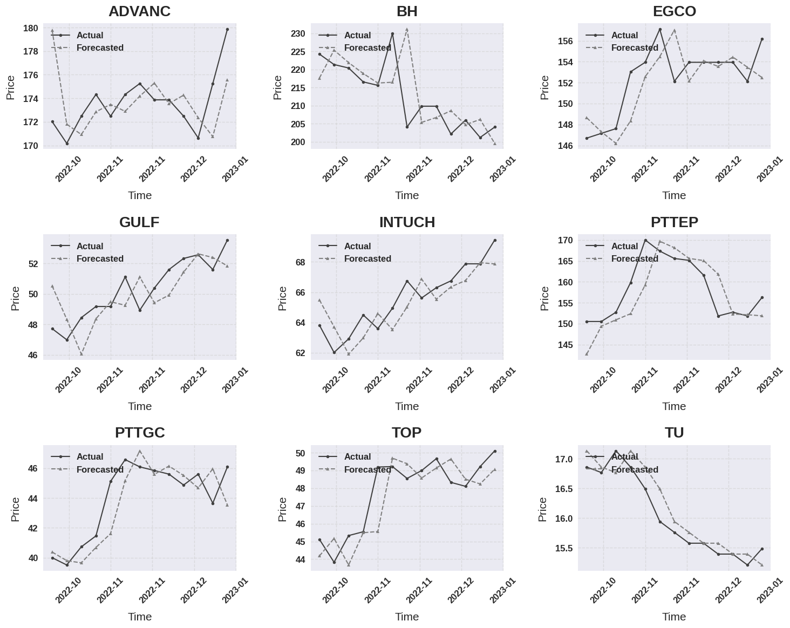
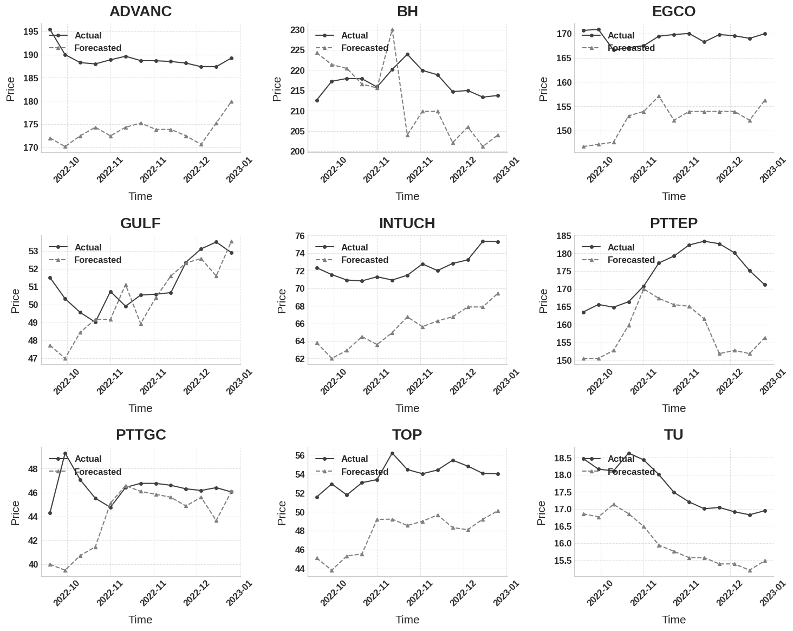
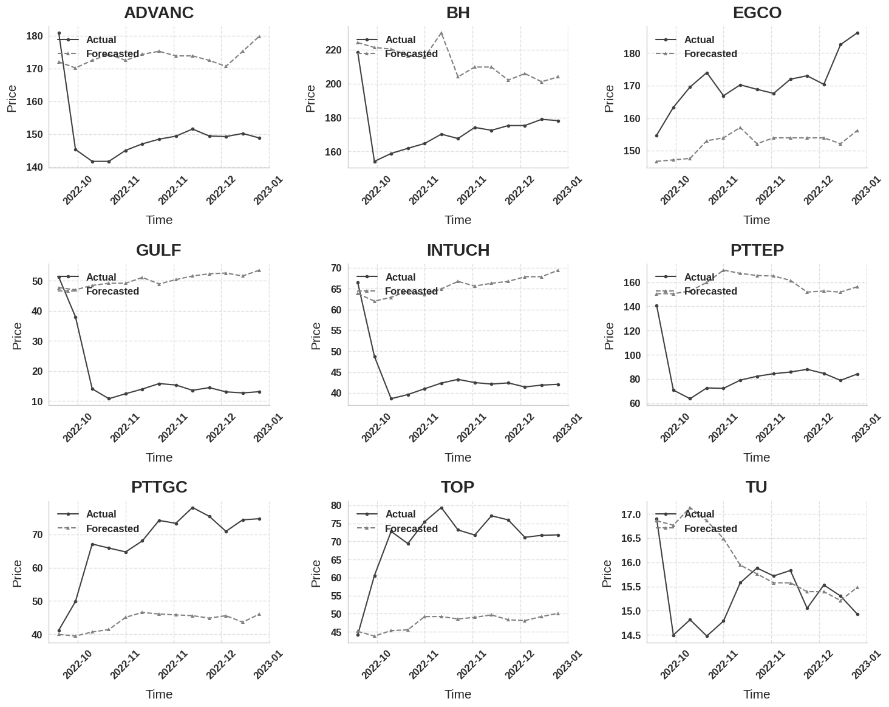

# Stock-Price-Forecasting-Traditional-vs.-Deep-Learning-Models

## Overview  
This project demonstrates the forecasting of stock prices and market directions using a combination of traditional time series models (ARIMA), Random Forest(RF), and deep learning architectures (LSTM and GRU). It aims to provide insights into the performance and accuracy of various forecasting techniques using real-world stock market data.
## Features  
- **Data Sources**: Weekly stock price and volume data from Yahoo Finance for nine Thai stocks.  
- **Models Implemented**:
  - **ARIMA**: Traditional statistical model for time series forecasting.
  - **LSTM**: Long Short-Term Memory neural networks for sequential data processing.
  - **RF**: Random Forest is used for time series forecasting.
  - **GRU**: Gated Recurrent Units for efficient time-series predictions.
- **Dual Input Capability**: Incorporates both price and volume data for RF and LSTM.  
- **Metrics**: Comprehensive evaluation using:
  - Root Mean Squared Error (RMSE)
  - Mean Absolute Error (MAE)
  - Mean Absolute Percentage Error (MAPE)
  - R-squared (R²)
  - Directional Accuracy  
- **Visualization**: Side-by-side comparison of actual vs. predicted prices with professional plots.
- **Outputs**:
  - Forecasted prices and directions.
  - Selected stocks based on predictions.
  - CSV exports of results for further analysis.

## Technologies  
- **Python Libraries**:
  - Data Processing: `pandas`, `numpy`, `yfinance`
  - Modeling: `statsmodels`, `tensorflow`, `keras`
  - Visualization: `matplotlib`, `seaborn`
  - **File Format**: [📘FORECASTING.ipynb](FORECASTING.ipynb)

## Results (Price forecasting)
**ARIMA**

**RF**

**LSTM**

## Results (Trend forecasting) 

**RF**

**LSTM**
 

## Conclusion
In summary, this chapter examined improving stock selection through dynamic
price prediction models, building on previous DEA analysis results. The study
used and compared three different forecasting models, namely ARIMA, LSTM and
Random Forest, to produce weekly price forecasts for nine stocks selected by the
DEA. As far as price prediction accuracy is concerned, the ARIMA model showed
superior performance with consistently low MAPE values between 1.26% and 2.92%.
Its effectiveness was particularly evident in stocks such as EGCO, ADVANC and
TU, with MAPE values of 1.26%, 1.32% and 1.39%, respectively. The LSTM model
showed more variable performance in price prediction with MAPE values between
4.68% and 67.72%, while the Random Forest model with MAPE values between
2.66% and 12. 84% achieved medium price prediction accuracy. However, when it
comes to directional prediction accuracy, a crucial metric for investment decisions in
our study, the random forest model showed superior performance overall, achieving
exceptional accuracy rates such as 92.31% for TU and 84.62% for BH and thus
significantly outperforms both the ARIMA and the LSTM models. The ARIMA
model showed moderate directional prediction ability with its best performance at
76.92% for ADVANC and TU, while LSTM achieved similar peaks but with less
consistency

